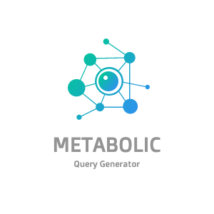
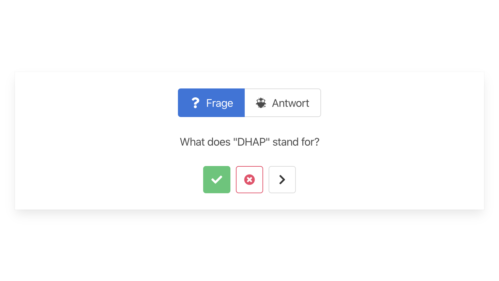

<!-- PROJECT LOGO -->
<br />
<p align="center">
    
  <h3 align="center">Metabolic Query Generator</h3>

  <p align="center">
    Human biology is tough 🤯- but learning about it isn't anymore 🥳 
    <br />
    <br />
    <a href="https://metabolic-query-generator.herokuapp.com/">View Demo</a>
    ·
    <a href="https://github.com/jgoerner/metabolic-query-generator/issues/new">Report Bug</a>
    ·
    <a href="https://github.com/jgoerner/metabolic-query-generator/issues/new">Request Feature</a>
  </p>
</p>


<!-- TABLE OF CONTENTS -->
## Table of Contents

* [About the Project](#about-the-project)
  * [Built With](#built-with)
* [Getting Started](#getting-started)
  * [Prerequisites](#prerequisites)
  * [Installation](#installation)
* [Usage](#usage)
* [Roadmap](#roadmap)
* [Contributing](#contributing)
* [License](#license)
* [Contact](#contact)
* [Acknowledgements](#acknowledgements)


<!-- ABOUT THE PROJECT -->
## About The Project

<p align="center">
          
</p>

This repository **helps people** who like to intensify their **knowledge about the human metabolic pathways**.
The main idea is to encode a variety of those pathways in a graph database, which can be used to **automatically generate questions** which might be used for **exam preparation**.

DISCLAIMER: As I did not study anything biology related, I can't ensure that all information is encoded correctly.
Therefore I highly encourage all attentive readers to [open an issue](https://github.com/jgoerner/query-generator/issues) whenever information shall be adjusted, in order to keep the knowledge as correct as possible. 

### Built & Hosted With

- [Spring Boot](https://spring.io/projects/spring-boot)
- [Neo4j](https://neo4j.com/)
- [Postgres](https://www.postgresql.org/)
- [Bulma](https://bulma.io/)
- [Heroku](https://www.heroku.com) 
- [Digital Ocean](www.digitalocean.com)
- Coffee ☕️ & Love ❤️

<!-- GETTING STARTED -->
## Getting Started

### Prerequisites

- [Docker](https://www.docker.com/)
- [Java 8+](https://aws.amazon.com/corretto/)

### Installation

1. Ramp up the infrastructure via `docker-compose up -d`
2. Launch the application via `./gradlew bootRun`
3. Open a web browser at `http://localhost:8080/index.html`

<!-- USAGE EXAMPLES -->
## Usage

### 🤹‍♀️ Live Demo
A live demo is available [here](https://metabolic-query-generator.herokuapp.com/) (as it is hosted on a [free Heroku Dyno](https://devcenter.heroku.com/articles/free-dyno-hours) it might have been put to sleep automatically - give it a few seconds to reboot once you hit the page).


### 👾 CLI Usage

#### Abbreviation ➡️ Name (`a2n`)
Query:<br>
`curl http://localhost:8080/api/v1/questions/random?type=a2n`<br><br>
Result:<br>
```
{
   "created" : "2020-03-15T22:39:12.489473",
   "question" : "What does 'PFK' stand for?",
   "qid" : "620ea062-4f0e-47b5-86a6-68990e9cfe67",
   "answer" : "Phosphofructokinase"
}
```

#### Name ➡️ Abbreviation (`n2a`)
Question:<br>
`curl http://localhost:8080/api/v1/questions/random?type=n2a` <br><br>
Result:<br>
```
{
   "answer" : "GAP-DH",
   "question" : "What is the abbreviation for 'Glycerinaldehyd-3-phosphat-Dehydrogenase'?",
   "qid" : "bc8d2301-cacf-400b-8111-302af4273d74",
   "created" : "2020-03-15T22:40:27.306076"
}
```

### 📱 Front End Usage
🚧 under construction 🚧


<!-- ROADMAP -->
## Roadmap

🧬🧪Metabolic Pathways:
- [ ] Glycolysis
- [ ] Pentose Phosphate Pathway
- [ ] Gluconeogenesis
- [ ] Cori Cycle
- [ ] ...

🤖❓Generated Question Types:

- [x] What does the abbreviation "FBP" stand for?
- [x] What is the abbreviation for Fructose bisphosphate?
- [ ] Which enzymes are part of the glycolysis?
- [ ] Which enzyme is responsible for the transormation from glucose to glucose-6-phosphate?
- [ ] What is the process to transform glucose into fructose 1,6 biphosphate?
- [ ] Which metabolic pathways consume nicotinamide adenine dinucleotide?
- [ ] Which metabolic pathways create adenosine triphosphate?
- [ ] What type of molecule is sucrose?
- [ ] What reactions of the glycolysis are reversible?
- [ ] What is the purpose of the Cori cycle?
- [ ] ...

🛠🎛 Admin Features:
- [x] Question Logging
- [x] Answer Logging
- [ ] Multitenancy
- [ ] (Learn) Progress Tracker

Further pathways and/or question types can be added by [raising an issue](https://github.com/jgoerner/query-generator/issues). 


<!-- CONTRIBUTING -->
## Contributing

Contributions are what make the open source community such an amazing place to be learn, inspire, and create. Any contributions you make are **greatly appreciated**.

1. Fork the Project
2. Create your Feature Branch (`git checkout -b feature/AmazingFeature`)
3. Commit your Changes (`git commit -m 'Add some AmazingFeature'`)
4. Push to the Branch (`git push origin feature/AmazingFeature`)
5. Open a Pull Request


<!-- LICENSE -->
## License

Distributed under the MIT License. See `LICENSE` for more information.


<!-- CONTACT -->
## Contact

Joshua Görner - [jgoerner](https://www.linkedin.com/in/jgoerner/) - joshua.goerner[at]gmail.com


<!-- ACKNOWLEDGEMENTS -->
## Acknowledgements
* [O. Drew](https://github.com/othneildrew/Best-README-Template) - nice GH Readme template
* designevo.com - Logo generated by [DesignEvo free logo designer](https://www.designevo.com/logo-maker/)
