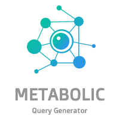

<!-- PROJECT LOGO -->
 

    
  <h3 align="center">Metabolic Query Generator</h3>

  

    Human biology is tough 🤯- but learning about it isn't anymore 🥳 
     
     
    <a href="">View Demo</a>
    ·
    <a href="">Report Bug</a>
    ·
    <a href="">Request Feature</a>
  

<!-- TABLE OF CONTENTS -->
## Table of Contents

* [About the Project](#about-the-project)
  * [Built With](#built-with)
* [Getting Started](#getting-started)
  * [Prerequisites](#prerequisites)
  * [Installation](#installation)
* [Usage](#usage)
* [Roadmap](#roadmap)
* [Contributing](#contributing)
* [License](#license)
* [Contact](#contact)
* [Acknowledgements](#acknowledgements)

<!-- ABOUT THE PROJECT -->
## About The Project

          

This repository **helps people** who like to intensify their **knowledge about the human metabolic pathways**.
The main idea is to encode a variety of those pathways in a graph database, which can be used to **automatically generate questions** which might be used for **exam preparation**.

DISCLAIMER: As I did not study anything biology related, I can't ensure that all information is encoded correctly.
Therefore I highly encourage all attentive readers to [open an issue](https://github.com/jgoerner/query-generator/issues) whenever information shall be adjusted, in order to keep the knowledge as correct as possible. 

### Built With

🚧 under construction 🚧

<!-- GETTING STARTED -->
## Getting Started

### Prerequisites

🚧 under construction 🚧

### Installation

🚧 under construction 🚧

<!-- USAGE EXAMPLES -->
## Usage

🚧 under construction 🚧

<!-- ROADMAP -->
## Roadmap

🧬🧪Metabolic Pathways:
- [ ] Glycolysis
- [ ] Pentose Phosphate Pathway
- [ ] Gluconeogenesis
- [ ] Cori Cycle
- [ ] ...

🤖❓Generated Question Types:

- [ ] What does the abbreviation "FBP" stand for?
- [ ] What is the abbreviation for Fructose bisphosphate?
- [ ] Which enzymes are part of the glycolysis?
- [ ] Which enzyme is responsible for the transormation from glucose to glucose-6-phosphate?
- [ ] What is the process to transform glucose into fructose 1,6 biphosphate?
- [ ] Which metabolic pathways consume nicotinamide adenine dinucleotide?
- [ ] Which metabolic pathways create adenosine triphosphate?
- [ ] What type of molecule is sucrose?
- [ ] What reactions of the glycolysis are reversible?
- [ ] What is the purpose of the Cori cycle?
- [ ] ...

Further pathways and/or question types can be added by [raising an issue](https://github.com/jgoerner/query-generator/issues). 

<!-- CONTRIBUTING -->
## Contributing

Contributions are what make the open source community such an amazing place to be learn, inspire, and create. Any contributions you make are **greatly appreciated**.

1. Fork the Project
2. Create your Feature Branch (`git checkout -b feature/AmazingFeature`)
3. Commit your Changes (`git commit -m 'Add some AmazingFeature'`)
4. Push to the Branch (`git push origin feature/AmazingFeature`)
5. Open a Pull Request

<!-- LICENSE -->
## License

Distributed under the MIT License. See `LICENSE` for more information.

<!-- CONTACT -->
## Contact

Joshua Görner - [jgoerner](https://www.linkedin.com/in/jgoerner/) - joshua.goerner[at]gmail.com

<!-- ACKNOWLEDGEMENTS -->
## Acknowledgements
* [O. Drew](https://github.com/othneildrew/Best-README-Template) - nice GH Readme template
* designevo.com - Logo generated by [DesignEvo free logo designer](https://www.designevo.com/logo-maker/)
